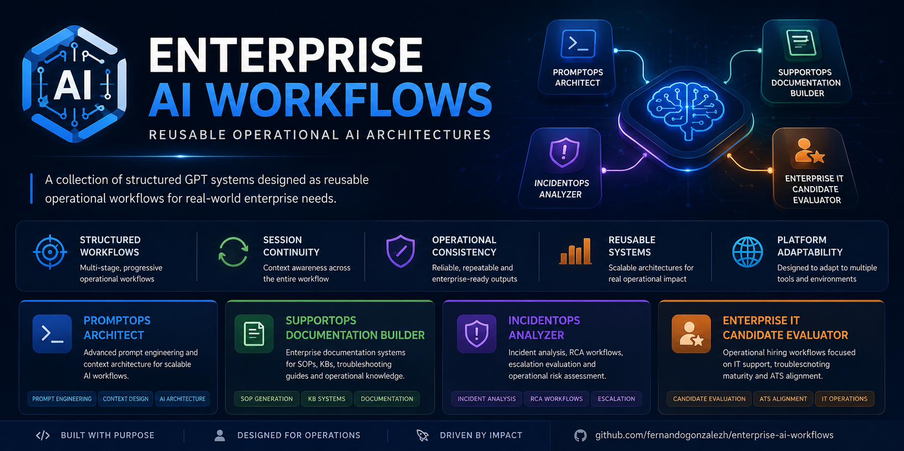
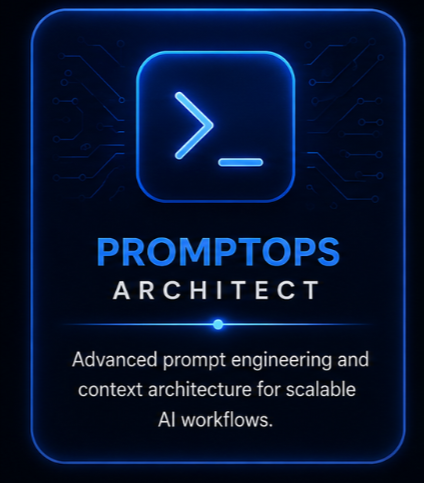
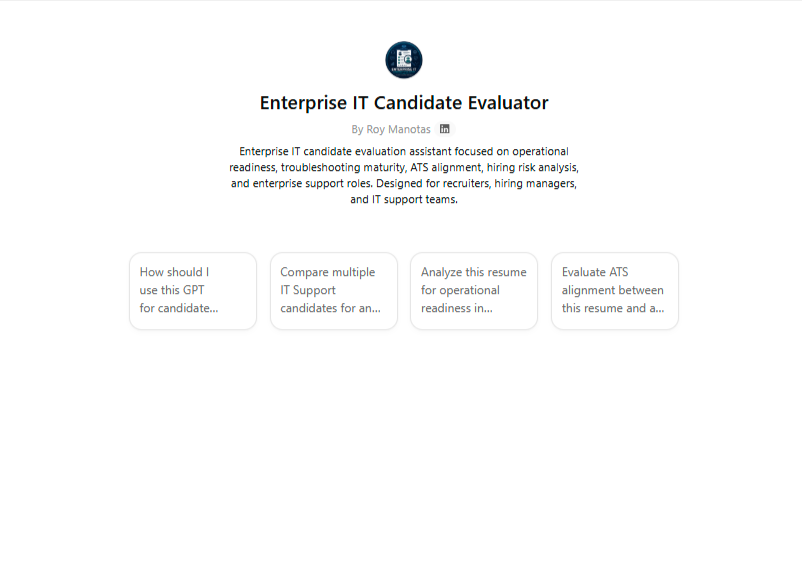
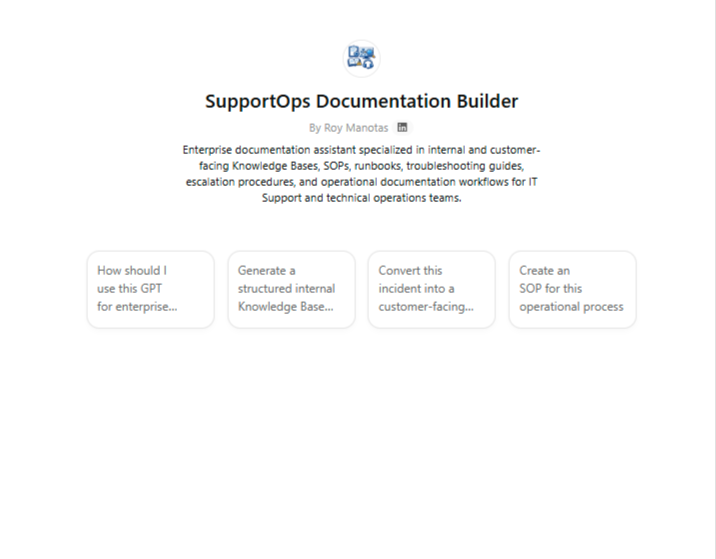
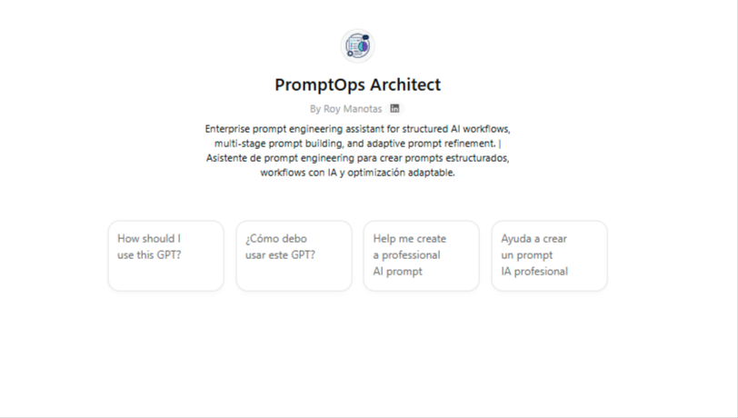

<p align="center">
  
</p>

<p align="center">
  
</p>

<h1 align="center">Enterprise AI Workflows</h1>

<p align="center">
Operational AI workflow systems for technical operations, documentation engineering, incident analysis, hiring workflows, and structured prompt architecture.
</p>

<p align="center">

<a href="https://chatgpt.com/g/g-6a14e6594618819190f712d15fb7fd40-enterprise-it-candidate-evaluator" target="_blank">

</a>

<a href="https://chatgpt.com/g/g-6a14f60406bc8191a075f0966571baa8-incidentops-analyzer" target="_blank">

</a>

<a href="https://chatgpt.com/g/g-6a14ffb74ab481918b779abb0e4baf25-supportops-documentation-builder" target="_blank">

</a>

<a href="https://chatgpt.com/g/g-6a150583881c8191a58a0be62d710648-promptops-architect" target="_blank">

</a>

</p>

---

# Executive Summary

Enterprise AI Workflows is a structured ecosystem of operational GPT systems designed for:

- technical operations
- incident analysis
- support documentation
- hiring workflows
- prompt architecture

The repository focuses on workflow-driven AI systems rather than isolated prompts or generic chatbot interactions.

Each GPT is designed as:
- a reusable operational workflow
- a structured interaction system
- a context-aware process engine
- a multi-stage AI workflow architecture

The goal is to explore how AI can improve:
- operational consistency
- documentation quality
- troubleshooting workflows
- structured AI collaboration
- reusable workflow design

---

# Sections

- Executive Summary
- Business Problem
- Core Capabilities
- Ecosystem Architecture
- GPT Systems
- Workflow Model
- Repository Structure
- Quick Start
- Example Workflow
- Design Principles
- Roadmap
- Public GPT Access

---

# Business Problem

Most AI repositories focus on:
- prompt collections
- isolated automations
- single-step interactions
- generic assistants

This repository explores a different problem:

> How can AI systems be structured as reusable operational workflows?

The ecosystem is designed to improve:
- interaction consistency
- operational clarity
- documentation quality
- troubleshooting continuity
- structured AI collaboration
- reusable workflow systems

---

# Core Capabilities

| Capability | Description |
|---|---|
| Structured AI Workflows | Multi-stage interaction systems instead of single prompts |
| Operational Context Gathering | Guided workflows that reduce ambiguity |
| Platform-Adaptive Responses | Output structures adapted to operational use cases |
| Documentation Engineering | AI-assisted SOPs, KBs, and troubleshooting documentation |
| Incident Analysis | Structured RCA and escalation-oriented workflows |
| Prompt Architecture | Reusable prompt systems and workflow orchestration |
| Hiring Operations | Operational candidate evaluation workflows |

---

# Ecosystem Architecture

<p align="center">
  
</p>

The repository is structured as a modular ecosystem of operational AI workflow systems.

Each workflow follows a common interaction model:

```text
User Input
   ↓
Context Gathering
   ↓
Workflow Routing
   ↓
Structured Processing
   ↓
Operational Output
   ↓
Iterative Refinement
```

The architecture prioritizes:
- reusable workflow design
- operational consistency
- modular GPT systems
- scalable prompt structures
- structured human-AI interaction

---

# GPT Systems

| GPT System | Focus Area | Primary Function |
|---|---|---|
| Enterprise IT Candidate Evaluator | Hiring Operations | Structured evaluation workflows for IT support hiring |
| IncidentOps Analyzer | Incident Operations | Incident triage, RCA workflows, escalation analysis |
| SupportOps Documentation Builder | Documentation Operations | SOPs, KBs, troubleshooting guides, operational documentation |
| PromptOps Architect | Prompt Engineering | Prompt systems, workflow architecture, instruction design |

---

# Workflow Model

Each GPT system follows a workflow-oriented interaction pattern instead of a generic chatbot model.

## Standard Workflow Pattern

```text
1. Intake
2. Context Collection
3. Workflow Classification
4. Structured Processing
5. Operational Output
6. Refinement Loop
```

## Design Characteristics

- multi-stage interactions
- guided operational workflows
- reusable architecture patterns
- context preservation
- structured response systems
- operational formatting standards

---

# Repository Structure

```text
enterprise-ai-workflows/
│
├── assets/
│   ├── banners/
│   ├── diagrams/
│   ├── icons/
│   └── screenshots/
│
├── gpts/
│   ├── enterprise-it-candidate-evaluator/
│   ├── incidentops-analyzer/
│   ├── promptops-architect/
│   └── supportops-documentation-builder/
│
├── docs/
│   ├── architecture/
│   ├── workflows/
│   └── examples/
│
├── README.md
└── LICENSE
```

---

# Quick Start

## Explore the GPT Systems

| GPT | Access |
|---|---|
| Enterprise IT Candidate Evaluator | <a href="https://chatgpt.com/g/g-6a14e6594618819190f712d15fb7fd40-enterprise-it-candidate-evaluator" target="_blank">Launch GPT</a> |
| IncidentOps Analyzer | <a href="https://chatgpt.com/g/g-6a14f60406bc8191a075f0966571baa8-incidentops-analyzer" target="_blank">Launch GPT</a> |
| SupportOps Documentation Builder | <a href="https://chatgpt.com/g/g-6a14ffb74ab481918b779abb0e4baf25-supportops-documentation-builder" target="_blank">Launch GPT</a> |
| PromptOps Architect | <a href="https://chatgpt.com/g/g-6a150583881c8191a58a0be62d710648-promptops-architect" target="_blank">Launch GPT</a> |

---

## Recommended Exploration Path

### 1. Start with SupportOps Documentation Builder

Best introduction to the workflow-driven interaction model.

Focus areas:
- SOP generation
- troubleshooting documentation
- operational procedures
- platform-adaptive formatting

---

### 2. Explore IncidentOps Analyzer

Demonstrates structured troubleshooting and RCA workflows.

Focus areas:
- incident triage
- escalation readiness
- impact assessment
- operational analysis

---

### 3. Review PromptOps Architect

Shows reusable prompt architecture and workflow orchestration patterns.

Focus areas:
- context engineering
- instruction architecture
- reusable AI systems
- structured prompting workflows

---

# Example Workflow

## Incident Analysis Workflow

```text
Incident Intake
   ↓
Severity Classification
   ↓
Operational Context Gathering
   ↓
Impact Assessment
   ↓
Troubleshooting Workflow
   ↓
Root Cause Analysis
   ↓
Escalation Guidance
   ↓
Structured Incident Summary
```

This approach improves:
- consistency
- troubleshooting continuity
- operational clarity
- escalation readiness
- documentation quality

---

# Design Principles

The repository is intentionally designed around:

| Principle | Focus |
|---|---|
| Workflow-Driven AI | Structured operational interaction |
| Operational Clarity | Clear, actionable outputs |
| Context Engineering | Progressive context gathering |
| Reusability | Modular workflow architecture |
| Human-in-the-Loop Design | AI-assisted, human-validated workflows |
| Readability | Clean operational formatting |
| Scalability | Reusable workflow systems |

The repository intentionally avoids:
- prompt dumping
- generic chatbot behavior
- overly abstract AI philosophy
- unnecessary enterprise theater
- fake governance structures

---

# Current GPT Systems

---

## Enterprise IT Candidate Evaluator

<p align="center">
  
</p>

Structured hiring workflow system for:
- IT Support
- Service Desk
- Technical Support
- Support Operations

Focused on:
- ATS alignment
- troubleshooting maturity
- operational readiness
- hiring risk analysis
- support workflow evaluation

### Open GPT

<a href="https://chatgpt.com/g/g-6a14e6594618819190f712d15fb7fd40-enterprise-it-candidate-evaluator" target="_blank">
Launch Enterprise IT Candidate Evaluator
</a>

### Preview

<p align="center">
  
</p>

---

## IncidentOps Analyzer

<p align="center">
  
</p>

Operational incident analysis workflow system focused on:
- incident triage
- escalation readiness
- root cause analysis
- troubleshooting workflows
- operational impact assessment
- incident progression management

### Open GPT

<a href="https://chatgpt.com/g/g-6a14f60406bc8191a075f0966571baa8-incidentops-analyzer" target="_blank">
Launch IncidentOps Analyzer
</a>

### Preview

<p align="center">
  
</p>

---

## SupportOps Documentation Builder

<p align="center">
  
</p>

Operational documentation workflow system specialized in:
- SOP generation
- troubleshooting documentation
- operational procedures
- knowledge management workflows
- customer-facing documentation
- platform-adaptive formatting

### Open GPT

<a href="https://chatgpt.com/g/g-6a14ffb74ab481918b779abb0e4baf25-supportops-documentation-builder" target="_blank">
Launch SupportOps Documentation Builder
</a>

### Preview

<p align="center">
  
</p>

---

## PromptOps Architect

<p align="center">
  
</p>

Structured AI workflow system specialized in:
- prompt engineering
- context engineering
- instruction optimization
- workflow architecture
- reusable AI systems
- platform-adaptive prompting

### Open GPT

<a href="https://chatgpt.com/g/g-6a150583881c8191a58a0be62d710648-promptops-architect" target="_blank">
Launch PromptOps Architect
</a>

### Preview

<p align="center">
  
</p>

---

# Roadmap

## Current Focus

- workflow refinement
- architecture standardization
- improved onboarding
- reusable workflow templates
- expanded operational examples

---

## Planned Improvements

- additional workflow systems
- cross-GPT workflow orchestration
- visual workflow documentation
- expanded architecture diagrams
- reusable documentation templates
- operational workflow libraries

---

# Public GPT Access

| GPT System | Public Access |
|---|---|
| Enterprise IT Candidate Evaluator | <a href="https://chatgpt.com/g/g-6a14e6594618819190f712d15fb7fd40-enterprise-it-candidate-evaluator" target="_blank">Open GPT</a> |
| IncidentOps Analyzer | <a href="https://chatgpt.com/g/g-6a14f60406bc8191a075f0966571baa8-incidentops-analyzer" target="_blank">Open GPT</a> |
| SupportOps Documentation Builder | <a href="https://chatgpt.com/g/g-6a14ffb74ab481918b779abb0e4baf25-supportops-documentation-builder" target="_blank">Open GPT</a> |
| PromptOps Architect | <a href="https://chatgpt.com/g/g-6a150583881c8191a58a0be62d710648-promptops-architect" target="_blank">Open GPT</a> |

---

# Author

Roy Manotas

IT Support • Support Operations • Documentation Engineering • AI Workflow Systems

### GitHub
https://github.com/iamroymadelva

### LinkedIn
https://www.linkedin.com/in/roymadelva

---

# Repository Focus

This repository is a portfolio and research project exploring how AI systems can be structured as operational workflow platforms instead of isolated prompt interactions.
