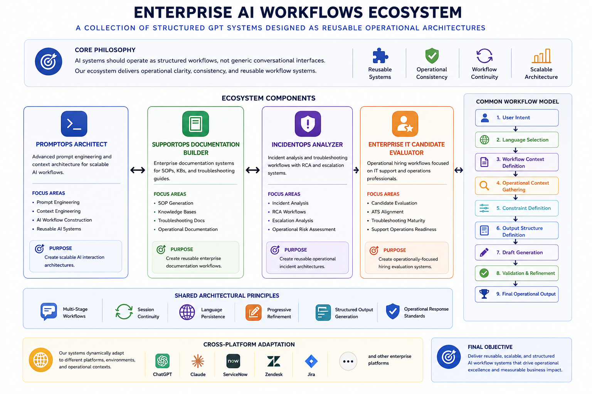

# Architecture Overview

The Enterprise AI Workflows repository is a modular ecosystem of workflow-oriented GPT systems designed for operational support, documentation, troubleshooting, and AI workflow engineering.

The repository focuses on structured operational workflows instead of generic chatbot interactions or prompt collections.

---

# Architecture Philosophy

The ecosystem is designed around a simple principle:

```text
AI systems should behave like structured operational workflows,
not isolated prompt interactions.
```

Each GPT functions as a specialized operational module responsible for a defined workflow domain.

The architecture prioritizes:

* workflow-oriented interactions
* modular operational systems
* reusable workflow structures
* context-aware processing
* concise operational outputs
* structured human-AI collaboration

The repository intentionally avoids:

* prompt dumping
* fake enterprise infrastructure
* excessive governance
* unnecessary complexity
* artificial operational abstractions

---

# Ecosystem Structure

<p align="center">
  
</p>

```text
Enterprise AI Workflows
│
├── assets/
│
├── docs/
│   ├── architecture-overview.md
│   └── workflow-overview.md
│
├── examples/
│   ├── incident-analysis-example.md
│   ├── sop-example.md
│   ├── prompt-workflow-example.md
│   └── candidate-evaluation-example.md
│
├── gpts/
│   ├── enterprise-it-candidate-evaluator/
│   ├── incidentops-analyzer/
│   ├── promptops-architect/
│   └── supportops-documentation-builder/
│
└── README.md
```

The repository is intentionally lightweight, modular, and documentation-oriented.

---

# Core Ecosystem Modules

## Enterprise IT Candidate Evaluator

Workflow system focused on:

* technical candidate evaluation
* troubleshooting maturity analysis
* operational readiness assessment
* structured hiring workflows

Primary ecosystem role:

```text
Technical evaluation workflow module
```

---

## IncidentOps Analyzer

Workflow system specialized in:

* incident analysis
* escalation workflows
* root cause investigation
* troubleshooting continuity

Primary ecosystem role:

```text
Incident operations workflow module
```

---

## SupportOps Documentation Builder

Documentation workflow system specialized in:

* SOP generation
* KB workflows
* troubleshooting documentation
* reusable operational documentation

Primary ecosystem role:

```text
Documentation workflow module
```

---

## PromptOps Architect

Workflow engineering system specialized in:

* prompt architecture
* context engineering
* reusable workflow systems
* AI workflow optimization

Primary ecosystem role:

```text
Workflow architecture module
```

---

# Shared Workflow Architecture

All GPT systems follow a shared workflow-oriented interaction model.

```text
User Request
      ↓
Context Collection
      ↓
Workflow Classification
      ↓
Structured Processing
      ↓
Operational Output
      ↓
Iterative Refinement
```

This workflow structure improves:

* operational consistency
* context continuity
* workflow reproducibility
* output clarity
* documentation quality

The ecosystem intentionally avoids relying on isolated single-prompt interactions.

---

# Workflow Modularity

Each GPT functions as an independent operational workflow module.

The ecosystem architecture prioritizes:

* modular workflows
* reusable interaction patterns
* operational specialization
* workflow continuity
* structured outputs

The modules are designed to complement each other without depending on rigid orchestration.

---

# Cross-Workflow Orchestration

The ecosystem supports workflow-oriented orchestration between GPT systems.

Example workflow chain:

```text
IncidentOps Analyzer
        ↓
Operational Findings
        ↓
SupportOps Documentation Builder
        ↓
Structured Documentation
        ↓
PromptOps Architect
        ↓
Workflow Optimization
```

This interaction model allows workflows to behave as connected operational systems instead of disconnected chatbot sessions.

---

# Shared Workflow Patterns

All systems follow shared operational design patterns.

## Intake-First Interactions

Workflows gather operational context before generating outputs.

---

## Context-Aware Processing

Responses are progressively refined through staged interactions.

---

## Structured Outputs

Outputs prioritize:

* readability
* operational formatting
* workflow clarity
* markdown scanning
* reusable structures

---

## Iterative Refinement

All workflows support progressive refinement through continued interaction.

---

## Modular Workflow Design

Each GPT is designed as a reusable operational component with a clearly defined workflow role.

---

# Documentation Structure

Each GPT module follows a consistent lightweight structure:

```text
README.md
architecture.md
workflow.md
examples.md
```

This improves:

* repository consistency
* navigation clarity
* modular readability
* GitHub scanning UX

---

# Operational Design Principles

The ecosystem follows a workflow-first operational philosophy.

## Core Principles

| Principle                 | Focus                               |
| ------------------------- | ----------------------------------- |
| Workflow-Oriented AI      | Structured operational interactions |
| Operational Clarity       | Readable and actionable outputs     |
| Modular Systems           | Reusable workflow components        |
| Context Engineering       | Progressive context gathering       |
| Documentation Readability | Scanning-first markdown formatting  |
| Reusable Architecture     | Shared workflow patterns            |

---

# Architecture Summary

Enterprise AI Workflows is designed as a modular operational AI ecosystem focused on workflow structure, documentation clarity, and reusable interaction systems.

The repository emphasizes:

* workflow engineering
* operational orchestration
* modular AI systems
* structured documentation
* reusable workflows
* operational readability
