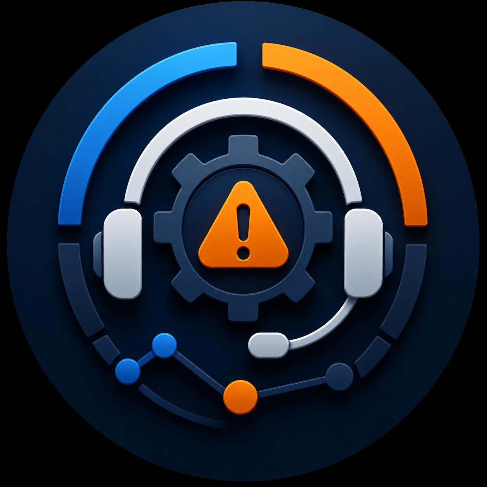
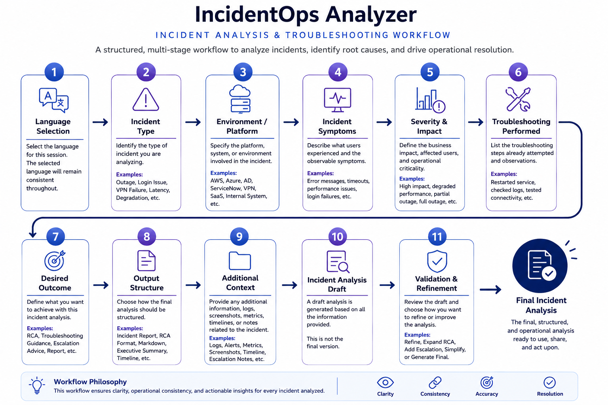
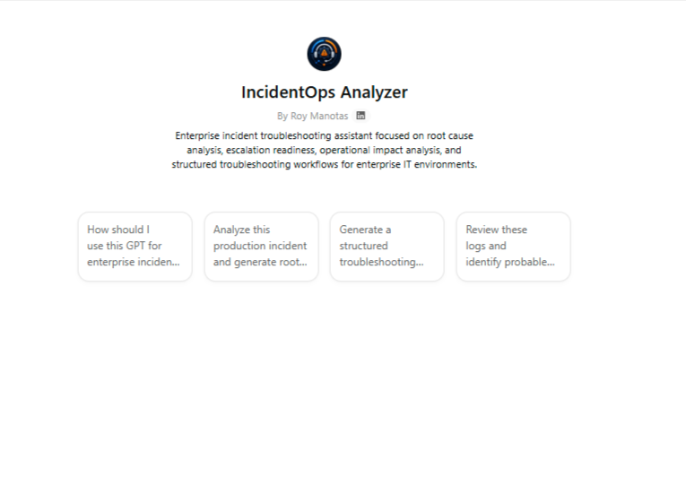

# IncidentOps Analyzer

<p align="center">
  
</p>

Workflow-oriented incident analysis system focused on structured troubleshooting, escalation readiness, and root cause investigation.

---

## Operational Focus

IncidentOps Analyzer is designed for:

* incident analysis
* root cause workflows
* escalation evaluation
* operational troubleshooting
* incident impact assessment
* structured incident reporting

The system prioritizes operational workflows instead of generic troubleshooting interactions.

---

## Workflow Structure

<p align="center">
  
</p>

IncidentOps Analyzer follows a staged operational workflow model.

```text
Incident Intake
      ↓
Context Collection
      ↓
Severity Assessment
      ↓
Hypothesis Analysis
      ↓
Operational Evaluation
      ↓
Structured Output
      ↓
Iterative Refinement
```

The workflow is designed to improve:

* troubleshooting consistency
* escalation quality
* RCA structure
* operational visibility
* workflow continuity

---

## Interaction Model

The GPT uses progressive workflow stages instead of isolated troubleshooting responses.

### Core Workflow Patterns

* intake-first interactions
* hypothesis-based reasoning
* evidence-aware analysis
* staged troubleshooting
* escalation readiness validation
* iterative refinement

---

## Supported Incident Workflows

IncidentOps Analyzer supports workflows for:

* SaaS incidents
* authentication failures
* infrastructure incidents
* connectivity issues
* API failures
* monitoring alerts
* operational degradations
* escalation preparation

---

## Analysis Model

The workflow prioritizes evidence-based operational analysis.

### Core Analysis Areas

| Area                 | Focus                                      |
| -------------------- | ------------------------------------------ |
| Incident Analysis    | Structured troubleshooting workflows       |
| RCA Support          | Hypothesis-driven root cause analysis      |
| Escalation Readiness | Validation of troubleshooting completeness |
| Operational Impact   | Business and service impact visibility     |
| Incident Continuity  | Structured progression tracking            |

---

## Workflow Characteristics

Outputs are optimized for:

* operational clarity
* markdown readability
* concise formatting
* escalation readiness
* structured troubleshooting
* reusable incident documentation

---

## Example Workflow Requests

* Analyze this production incident
* Generate an RCA for this outage
* Evaluate this escalation scenario
* Create a structured incident report

---

## Example Workflow

```text
Incident Report
      ↓
Context Gathering
      ↓
Severity Validation
      ↓
Hypothesis Generation
      ↓
Operational Analysis
      ↓
Escalation Guidance
      ↓
Structured Incident Summary
```

---

## Repository Structure

```text
incidentops-analyzer/
│
├── README.md
├── architecture.md
├── workflow.md
├── examples.md
└── screenshots/
```

---

## Public GPT Access

<a href="https://chatgpt.com/g/g-6a14f60406bc8191a075f0966571baa8-incidentops-analyzer" target="_blank">
Launch IncidentOps Analyzer
</a>

---

## Preview

<p align="center">
  
</p>

---

## Documentation

Additional documentation:

* [Architecture](./architecture.md)
* [Workflow Structure](./workflow.md)
* [Workflow Examples](./examples.md)

---

## Operational Principles

IncidentOps Analyzer is designed around:

* structured incident workflows
* evidence-aware troubleshooting
* escalation discipline
* workflow continuity
* operational realism
* reusable analysis structures

The system intentionally avoids:

* vague troubleshooting
* unsupported assumptions
* random troubleshooting paths
* generic chatbot behavior
* shallow RCA analysis

---

## Repository Role

IncidentOps Analyzer functions as the incident operations workflow module within the Enterprise AI Workflows ecosystem.

The workflow architecture focuses on structured troubleshooting orchestration, escalation quality, and reusable operational incident analysis.
