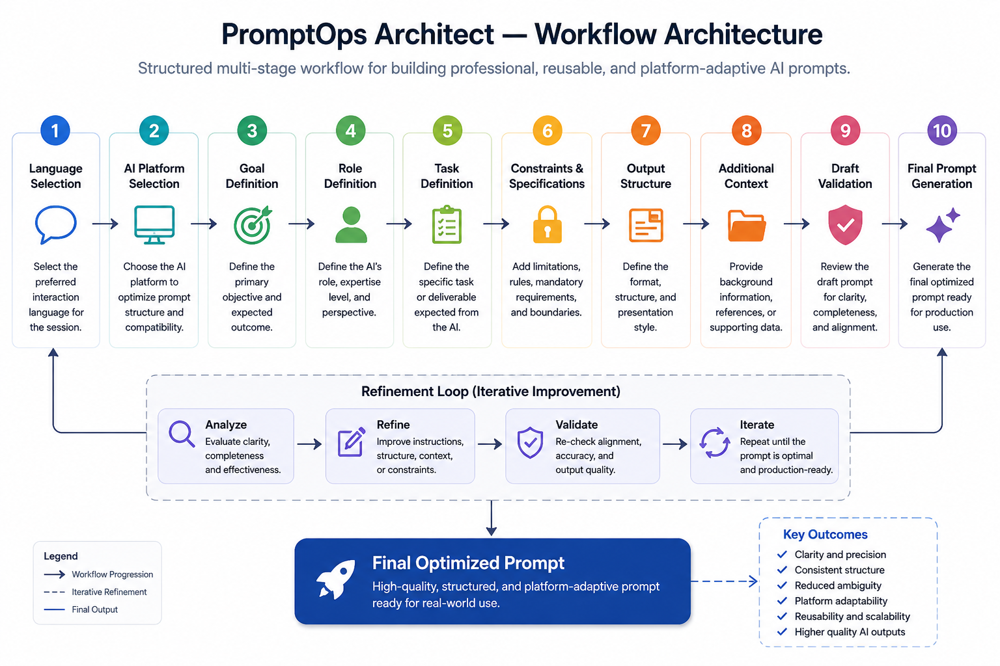

# PromptOps Architecture

This document describes the operational architecture, workflow structure, and AI interaction orchestration patterns used by PromptOps Architect.

The system is designed as a workflow-oriented AI architecture module within the Enterprise AI Workflows ecosystem.

---

# Operational Purpose

PromptOps Architect is built to support structured AI workflow design instead of isolated prompt generation.

The architecture prioritizes:

* instruction clarity
* context engineering
* reusable AI workflows
* workflow continuity
* constraint-aware interactions
* structured output design

The system is designed to behave like an AI workflow architecture engine rather than a generic prompt assistant.

---

# Workflow Architecture

<p align="center">
  
</p>

The workflow architecture follows a staged AI workflow design model.

```text id="jlwmq0"
Workflow Goal
      ↓
AI Platform Selection
      ↓
Role Definition
      ↓
Task Structuring
      ↓
Constraint Engineering
      ↓
Context Organization
      ↓
Output Design
      ↓
Refinement Loop
```

This structure improves:

* AI alignment
* workflow consistency
* instruction quality
* output structure
* reusable AI interactions

---

# Core Architecture Model

PromptOps Architect uses progressive workflow orchestration instead of isolated prompt construction.

## Workflow Layers

| Layer             | Operational Function                  |
| ----------------- | ------------------------------------- |
| Intake Layer      | Initial workflow objective collection |
| Platform Layer    | AI platform adaptation                |
| Role Layer        | AI behavior definition                |
| Structuring Layer | Workflow and instruction organization |
| Constraint Layer  | Behavioral and formatting control     |
| Output Layer      | Structured prompt generation          |
| Refinement Layer  | Iterative workflow improvement        |

---

# Instruction Architecture Model

The workflow is designed around structured instruction hierarchy.

## Workflow Priorities

* clarify objectives before prompt construction
* separate goals from tasks
* define AI roles explicitly
* structure instructions progressively
* reduce ambiguity
* optimize workflow maintainability

---

# Context Engineering Architecture

PromptOps Architect uses context-aware workflow design to improve AI interaction quality.

```text id="jlwmpz"
Workflow Context
      ↓
Instruction Hierarchy
      ↓
Constraint Definition
      ↓
Output Structuring
      ↓
AI Alignment
```

This improves:

* context precision
* response consistency
* workflow continuity
* reusable prompt systems

---

# Goal vs Task Differentiation

The architecture separates workflow objectives from operational tasks.

## Examples

| Goal     | Task                          |
| -------- | ----------------------------- |
| Analyze  | Analyze incident reports      |
| Optimize | Optimize onboarding workflows |
| Create   | Create reusable SOP prompts   |
| Automate | Automate support workflows    |

This separation improves instruction clarity and workflow structure.

---

# Constraint Engineering

The workflow includes structured constraint design.

## Constraint Areas

* formatting rules
* forbidden behaviors
* response structure
* verbosity control
* technical depth
* workflow limitations

Constraint definition improves:

* output consistency
* AI alignment
* ambiguity reduction
* workflow maintainability

---

# Platform Adaptation

PromptOps Architect is platform-aware without assuming identical AI behavior across systems.

Supported AI environments include:

* ChatGPT
* Claude
* Gemini
* Cursor
* Copilot
* Midjourney
* custom AI systems

The workflow dynamically adapts depending on the selected AI platform.

---

# Workflow Continuity

The architecture maintains workflow continuity throughout the AI interaction lifecycle.

The workflow preserves:

* selected AI platform
* workflow objective
* AI role
* constraints
* output structure
* refinement history

This improves reusable workflow consistency and reduces interaction fragmentation.

---

# Refinement Architecture

PromptOps Architect uses iterative refinement workflows instead of single-pass prompt generation.

```text id="jlwmpy"
Initial Workflow Draft
      ↓
Instruction Review
      ↓
Constraint Refinement
      ↓
Output Optimization
      ↓
Reusable AI Workflow
```

This improves:

* workflow clarity
* instruction precision
* AI alignment
* output quality
* maintainability

---

# Operational Output Structure

Outputs are optimized for:

* markdown readability
* reusable AI workflows
* structured interaction design
* operational clarity
* concise formatting
* scalable instruction systems

---

# Repository Integration

PromptOps Architect functions as the AI workflow architecture module within the Enterprise AI Workflows ecosystem.

Primary ecosystem responsibilities:

* AI workflow orchestration
* reusable prompt systems
* instruction architecture
* context engineering
* AI interaction optimization

---

# Shared Ecosystem Patterns

PromptOps Architect follows shared ecosystem-wide workflow principles:

* intake-first interactions
* staged processing
* context-aware workflows
* iterative refinement
* operational formatting
* reusable workflow structures

---

# Design Principles

| Principle                   | Focus                                    |
| --------------------------- | ---------------------------------------- |
| Workflow-Oriented AI Design | Structured AI interaction systems        |
| Instruction Clarity         | Reduced ambiguity and stronger alignment |
| Context Engineering         | Structured contextual workflows          |
| Constraint Awareness        | Controlled AI behavior shaping           |
| Workflow Continuity         | Progressive workflow refinement          |
| Reusable Structures         | Scalable AI workflow systems             |

---

# Architecture Summary

PromptOps Architect is designed as a structured AI workflow architecture system focused on reusable interaction models, instruction hierarchy, and context-aware AI workflow design.

The architecture emphasizes:

* staged AI workflows
* reusable prompt systems
* structured instruction design
* iterative refinement
* context engineering
* workflow continuity
