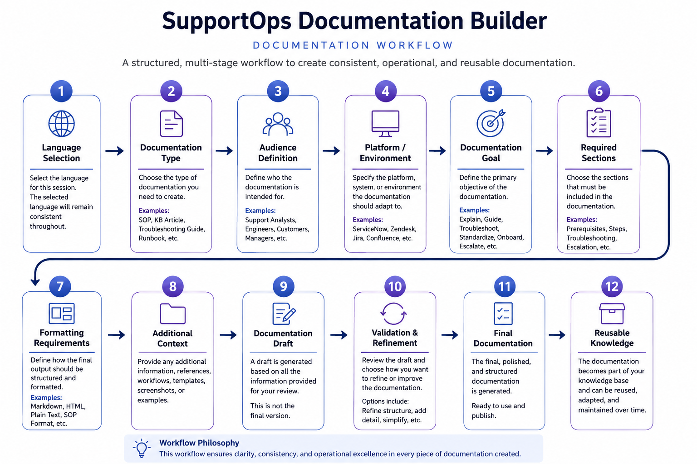

# SupportOps Documentation Builder

<p align="center">
  
</p>

Workflow-oriented documentation system focused on structured operational knowledge, reusable support documentation, and scalable documentation workflows.

---

## Operational Focus

SupportOps Documentation Builder is designed for:

* SOP generation
* knowledge base workflows
* troubleshooting documentation
* onboarding procedures
* operational runbooks
* escalation documentation
* customer-facing guides
* reusable documentation systems

The system prioritizes operational documentation workflows instead of generic AI writing interactions.

---

## Workflow Structure

<p align="center">
  
</p>

SupportOps Documentation Builder follows a staged operational workflow model.

```text id="jlwmsh"
Documentation Request
      ↓
Context Collection
      ↓
Audience Definition
      ↓
Workflow Structuring
      ↓
Formatting Strategy
      ↓
Operational Draft
      ↓
Iterative Refinement
```

The workflow is designed to improve:

* documentation consistency
* operational readability
* troubleshooting usability
* workflow continuity
* reusable knowledge structures

---

## Interaction Model

The GPT uses progressive workflow stages instead of isolated content generation.

### Core Workflow Patterns

* intake-first interactions
* audience-aware formatting
* structured documentation flows
* staged content generation
* platform-adaptive formatting
* iterative refinement

---

## Supported Documentation Workflows

SupportOps Documentation Builder supports workflows for:

* SOP documentation
* KB article generation
* troubleshooting guides
* onboarding workflows
* escalation procedures
* operational runbooks
* customer-facing documentation
* internal support documentation

---

## Documentation Model

The workflow prioritizes structured operational documentation.

### Core Documentation Areas

| Area                          | Focus                                |
| ----------------------------- | ------------------------------------ |
| SOP Workflows                 | Structured operational procedures    |
| Knowledge Systems             | Reusable support documentation       |
| Troubleshooting Documentation | Operational troubleshooting clarity  |
| Audience Adaptation           | Role-aware documentation formatting  |
| Workflow Continuity           | Structured documentation progression |

---

## Workflow Characteristics

Outputs are optimized for:

* markdown readability
* operational clarity
* concise formatting
* scanning UX
* reusable structures
* platform adaptability

---

## Example Workflow Requests

* Create a troubleshooting SOP
* Generate a customer-facing KB article
* Build an escalation procedure
* Convert raw notes into structured documentation

---

## Example Workflow

```text id="jlwmsg"
Raw Operational Notes
      ↓
Context Structuring
      ↓
Audience Definition
      ↓
Workflow Formatting
      ↓
Documentation Draft
      ↓
Formatting Refinement
      ↓
Final Operational Documentation
```

---

## Repository Structure

```text id="jlwmsf"
supportops-documentation-builder/
│
├── README.md
├── architecture.md
├── workflow.md
├── examples.md
└── screenshots/
```

---

## Public GPT Access

<a href="https://chatgpt.com/g/g-6a14ffb74ab481918b779abb0e4baf25-supportops-documentation-builder" target="_blank">
Launch SupportOps Documentation Builder
</a>

---

## Preview

<p align="center">
  
</p>

---

## Documentation

Additional documentation:

* [Architecture](./architecture.md)
* [Workflow Structure](./workflow.md)
* [Workflow Examples](./examples.md)

---

## Operational Principles

SupportOps Documentation Builder is designed around:

* structured documentation workflows
* reusable knowledge systems
* operational readability
* workflow continuity
* maintainable documentation structures
* audience-aware formatting

The system intentionally avoids:

* vague documentation
* generic AI writing
* fragmented knowledge structures
* inconsistent formatting
* unnecessary verbosity

---

## Repository Role

SupportOps Documentation Builder functions as the operational documentation workflow module within the Enterprise AI Workflows ecosystem.

The workflow architecture focuses on structured documentation orchestration, reusable knowledge systems, and operational documentation consistency.
